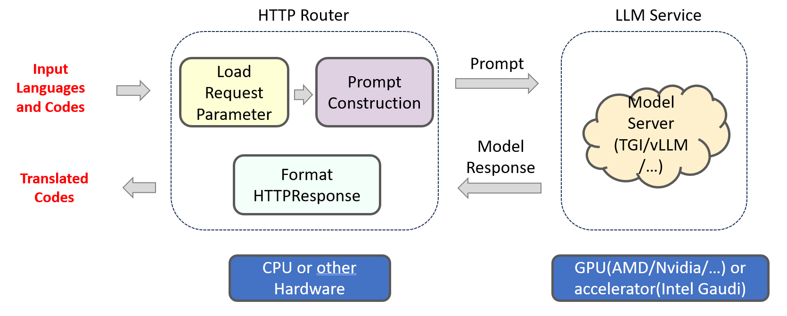

# Code Translation Application

Code translation is the process of converting code written in one programming language to another programming language while maintaining the same functionality. This process is also known as code conversion, source-to-source translation, or transpilation. Code translation is often performed when developers want to take advantage of new programming languages, improve code performance, or maintain legacy systems. Some common examples include translating code from Python to Java, or from JavaScript to TypeScript.

# Table of Contents

1. [Architecture](#architecture)
2. [Deployment Options](#deployment-options)
3. [Monitoring and Tracing](./README_miscellaneous.md)

## Architecture

The CodeTrans application is an end-to-end workflow that leverages the capability of LLMs. The workflow falls into the following architecture:

The CodeTrans example is implemented using the component-level microservices defined in [GenAIComps](https://github.com/opea-project/GenAIComps). The flow chart below shows the information flow between different microservices for this example.

```mermaid
---
config:
  flowchart:
    nodeSpacing: 400
    rankSpacing: 100
    curve: linear
  themeVariables:
    fontSize: 50px
---
flowchart LR
    %% Colors %%
    classDef blue fill:#ADD8E6,stroke:#ADD8E6,stroke-width:2px,fill-opacity:0.5
    classDef orange fill:#FBAA60,stroke:#ADD8E6,stroke-width:2px,fill-opacity:0.5
    classDef orchid fill:#C26DBC,stroke:#ADD8E6,stroke-width:2px,fill-opacity:0.5
    classDef invisible fill:transparent,stroke:transparent;
    style CodeTrans-MegaService stroke:#000000

    %% Subgraphs %%
    subgraph CodeTrans-MegaService["CodeTrans MegaService "]
        direction LR
        LLM([LLM MicroService]):::blue
    end
    subgraph UserInterface[" User Interface "]
        direction LR
        a([User Input Query]):::orchid
        UI([UI server<br>]):::orchid
    end


    LLM_gen{{LLM Service <br>}}
    GW([CodeTrans Gateway<br>]):::orange
    NG([Nginx MicroService]):::blue


    %% Questions interaction
    direction LR
    NG <==> UserInterface
    a[User Input Query] --> UI
    UI --> GW
    GW <==> CodeTrans-MegaService


    %% Embedding service flow
    direction LR
    LLM <-.-> LLM_gen

```

This Code Translation use case demonstrates Text Generation Inference across multiple platforms. Currently, we provide examples for [Intel Gaudi2](https://www.intel.com/content/www/us/en/products/details/processors/ai-accelerators/gaudi-overview.html) and [Intel Xeon Scalable Processors](https://www.intel.com/content/www/us/en/products/details/processors/xeon.html), and we invite contributions from other hardware vendors to expand OPEA ecosystem.

## Deployment Options

The table below lists currently available deployment options. They outline in detail the implementation of this example on selected hardware.

| Category | Deployment Option | Description |
|------------------|------------|------------------------------|
| On-premise Deployments | Docker compose | [CodeTrans deployment on Xeon](./docker_compose/intel/cpu/xeon) |
| | | [CodeTrans deployment on Gaudi](./docker_compose/intel/hpu/gaudi) |
| | | [CodeTrans deployment on  AMD ROCm](./docker_compose/amd/gpu/rocm) |
| | Kubernetes | [Helm Charts](./kubernetes/helm)|
| | | [GMC](./kubernetes/gmc)|
| | Azure | Work-in-progress  |
| | Intel Tiber AI Cloud | Work-in-progress |
